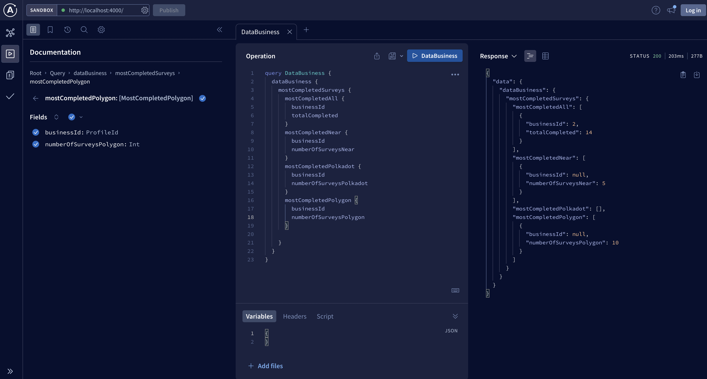
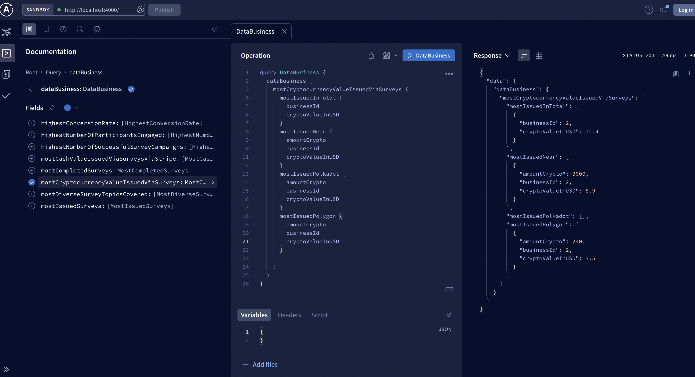

### Data - User:

1. **Most Completed Surveys:** Retrieve data on users who have completed the highest number of surveys. This helps identify highly active participants.

2. **Most Earned Cash Rewards (via Stripe):** Track users who have earned the most cash rewards through the Stripe payment system.

3. **Most Earned Cryptocurrency Rewards:** Identify users who have earned the most cryptocurrency rewards, both in total and per blockchain.

4. **Most Dollars Spent in the NFT Marketplace:** Find users who have spent the most real dollars on NFT purchases.

5. **Most Cryptocurrency Spent in the NFT Marketplace:** Identify users who have spent the most cryptocurrency on NFT purchases.

6. **Most Invited Users:** Determine which users have successfully invited the highest number of new users to the platform.

7. **Most Completed Surveys in a Specific Category:** Analyze users' survey completion rates in specific survey categories, such as technology or health.

`specific category query`

`null category query`

8. **Highest Average Survey Completion Rate:** Calculate and compare users' average survey completion rates.

9. **Most Consistent Survey Completion Frequency:** Identify users who consistently complete surveys with a specific frequency (e.g., daily, weekly).

10. **Highest Number of Consecutive Days with Survey Completions:** Track users with the longest streaks of consecutive days with completed surveys.

11. **Most Active Participation in Specific Types of Surveys:** Analyze users' engagement with different survey types, such as multiple-choice or open-ended.

12. **Most Referrals Converted into Active Survey Participants:** Measure the success of users' referral efforts in converting new users into active survey participants.

13. **Most Engagement with Community Features:** Identify users who actively engage with community features like forum posts, comments, and discussions.

14. **Most Creative and Unique Survey Responses:** Recognize users who provide creative and unique survey responses, including creative text and uploaded media.

### Data - User:

1. **Fastest Time to Complete a Survey:** Calculate the fastest time taken by a user to complete a survey, considering both the overall and per blockchain duration.
   

2. **Slowest Time to Complete a Survey:** Calculate the slowest time taken by a user to complete a survey, considering both the overall and per blockchain duration.
   

3. **Status and Duration of Unclaimed Rewards:** Track the status and duration of rewards that users have not claimed, both overall and per blockchain.
   

4. **Tutorial Completion:** Record whether users have completed tutorials or onboarding processes.
   

5. **Number of Wallets Connected:** Count the number of wallets connected to the system and specify the blockchain chain associated with each.
   

6. **Average Time per Session:** Calculate the average time a user spends in each session on the platform.
   

7. **Average Time per Survey:** Calculate the average time users spend on completing surveys.
   

8. **Average Time to Withdraw Rewards:** Determine the average time it takes for users to withdraw their rewards.
   

9. **Average Value Spent in the NFT Marketplace:** Compute the average amount spent by users in the NFT marketplace.
   

10. **Average Value Accrued in Cryptocurrency (Lifetime, Last Session, On Average):** Track users' average cryptocurrency earnings across their lifetime, during their last session, and on average.
    

11. **Average Value Accrued in Cash via Stripe (Lifetime, Last Session, On Average):** Monitor users' average cash earnings via Stripe across their lifetime, during their last session, and on average.
    

12. **NFT Marketplace Purchase History:** Capture the transaction history and lifetime value of purchases made by users in the NFT marketplace.
    

13. **Ranked Tags Among Completed Surveys:** Identify the most common tags associated with completed surveys, allowing for categorization.
    

14. **Most Common Time of Day for Survey Completion:** Determine the peak time when users frequently complete surveys.
    

15. **Survey Completion Rate Based on Number of Questions:** Calculate the survey completion rate based on the number of questions in each survey.
    

16. **Average Rating Given to Completed Surveys:** Measure the average rating assigned by users to completed surveys.
    

17. **User Engagement Rate with NFT Marketplace:** Analyze user engagement in the NFT marketplace, including views, interactions, and purchases.
    

18. **Subscription Level:** Track users' subscription levels, if applicable.
    

19. **Subscription History:** Record users' subscription history, including the packages they have subscribed to.
    

### Data - Business:

1. **Most Issued Surveys:** Retrieve data on businesses that have issued the highest number of surveys.

2. **Most Completed Surveys:** Track businesses with the most completed surveys, considering both the total number and per blockchain.

3. **Most Cryptocurrency Value Issued via Surveys:** Identify businesses that have issued the highest cryptocurrency value through surveys, both in total and per blockchain.

4. **Most Cash Value Issued via Surveys (via Stripe):** Find businesses that have issued the highest cash value rewards via the Stripe payment system.

5. **Highest Number of Successful Survey Campaigns:** Determine businesses that have successfully run the highest number of survey campaigns on the platform.

6. **Most Diverse Survey Topics Covered:** Analyze businesses that cover a wide range of survey topics within a single campaign.

7. **Highest Number of Participants Engaged:** Track businesses that have engaged the highest number of participants in a single survey campaign.

8. **Highest Conversion Rate:** Identify businesses with the highest conversion rates, measuring the transition from survey responses to desired actions (e.g., product purchases).

### Data - Marketplace:

1. **Fastest Time to Draft a Survey:** Calculate the fastest time taken by users to draft a survey, considering both overall and per blockchain duration.
   
2. **Slowest Time to Draft a Survey:** Calculate the slowest time taken by users to draft a survey, considering both overall and per blockchain duration.
   
3. **Status and Duration of Unclaimed Rewards:** Track the status and duration of rewards that users have not claimed, both overall and per blockchain.
   
4. **Number of Wallets Connected:** Count the number of wallets connected to the system and specify the blockchain chain associated with each.
   
5. **Average Time per Session:** Calculate the average time users spend in each session on the platform.
   
6. **Average Time per Survey:** Determine the average time users spend on drafting surveys.
   
7. **Average Time to Load Rewards:** Measure the average time it takes for users to load their rewards.
<!--  -->
8. **Ranked Tags Among Issued Surveys:** Identify the most common tags associated with issued surveys, allowing for categorization.
   
   
9. **Most Common Survey Length (Number of Questions) Preferred by Users:** Determine the preferred survey length based on the number of questions among users.
   
10. **Average Response Time of Users to Survey Invitations:** Calculate the average response time of users when they receive survey invitations.
    
11. **Correlation Between Survey Complexity and Completion Rate:** Analyze the relationship between survey complexity (e.g., length, difficulty) and the rate at which users complete surveys.
    
12. **Conversion Rate of Surveys to NFT Marketplace Purchases:** Track the conversion rate of completed surveys to purchases made in the NFT marketplace.
    <!--  -->

\*13. **Most Effective Methods for Attracting Survey Participants:** Identify the most effective methods employed by businesses to attract survey participants.

<!--  -->

\*14. **Subscription Level:** Monitor users' subscription levels, if applicable.

\*15. **Subscription History:** Record users' subscription history, including the packages they have subscribed to.

