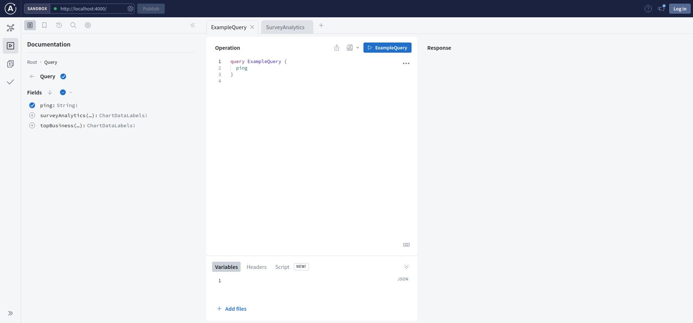

## TASK: Implement already existing SQL queries and GraphQL types/resolvers to collect and track user-centric marketplace analytics. 

GraphQL is a query language that allows you to create APIs with highly flexible and efficient data loading. It essentially offers an alternative to RESTful API architectures.

When combining GraphQL with Next.js API routes, you typically create a serverless function as your main GraphQL endpoint. From there, you handle all GraphQL requests, like queries and mutations, using resolvers inside this API route.

I'm using the GraphQL resolver as proxy, whenever a client makes a request to your Next.js/GraphQL API, the resolver function, acts as a middleman or proxy to interact with other external APIs, databases, or other data sources specific to that resolver.

Using the resolvers as a proxy has several benefits:

- It abstracts the specific logic to access data from the client.
- You can centralize data fetching and error handling in one place.
- Since each resolver fetches only its piece of data, you only load the data that’s requested (a feature of GraphQL), which improves efficiency and response times.

### 1. Implement(copy and paste) graphql queries to return the values from db

_References:_

/qstn-graphql-api-server/blob/main/server/schema.graphql#L10

/qstn-graphql-api-server/blob/main/server/queries.graphql#L1

### 2. Implement(copy and paste) graphql resolvers using sql queries available here:

_Reference:_
/qstn-graphql-api-server/blob/main/server/service/serviceResolver.ts#L79


### MORE REFERENCES

- GraphQL Schemas: /qstn-graphql-api-server/blob/main/server/schema.graphql
- GraphQL Resolvers: /qstn-graphql-api-server/blob/main/server/service/serviceResolver.ts


## SETUP - Getting Started

## 1. Install and run the server app:

#### Install pnpm
```sh
npm i -g pnpm
```

#### Clone the repository and run the app
```sh

$ git clone git@github.com:QSTN-labs/qstn-grqphql-backend-v2-implementation.git

$ cd qstn-graphql-api-server

$ pnpm install
```

## 2. Install docker and PSQL:

### DOCKER

```bash
Please check https://docs.docker.com/engine/install/ to get docker installed
```

### PSQL

```bash
Please check https://www.timescale.com/blog/how-to-install-psql-on-mac-ubuntu-debian-windows/
```

3. Setup docker postgres-db and restore the database:

### CREATE VOLUME

```bash
docker volume create qstn-vol
```

### CREATE DATABASE

```bash
docker run --name qstndb -p 5432:5432 -e POSTGRES_PASSWORD=YOURPASSWORD -e POSTGRES_USER=qstn -e POSTGRES_DB=qstndbv1 -v qstn-vol:/var/lib/postgresql/data -d postgres:15.3-alpine3.18
```

### RESTORE DATABASE

```bash
psql -U qstn -h localhost -p 5432 -d qstndbv1 -f docs/qstndbv1-backup-030723.sql
```

4. Update .env files with your db password:

```bash
PGUSER="qstn"
PGHOST="localhost"
PGPASSWORD="YOURPASSWORD"
PGDATABASE="qstndbv1"
PGPORT="5432"
```

5. Run the development server:

```bash
$ pnpm dev:server

--> open a 2nd terminal run the REST API server:
$ pnpm dev

-> Open in your browser: http://localhost:4000 
```

## ATTENTION

---

_After make changes in the _.graphql files you must run the command bellow to re-generate the whole graphql schema. Obs: Run the command from your root project\*

```bash
pnpm codegen && sh utils/schema.sh
```


Open [http://localhost:4000](http://localhost:4000) with your browser to see the result.

<p align="center">
  
</p>
